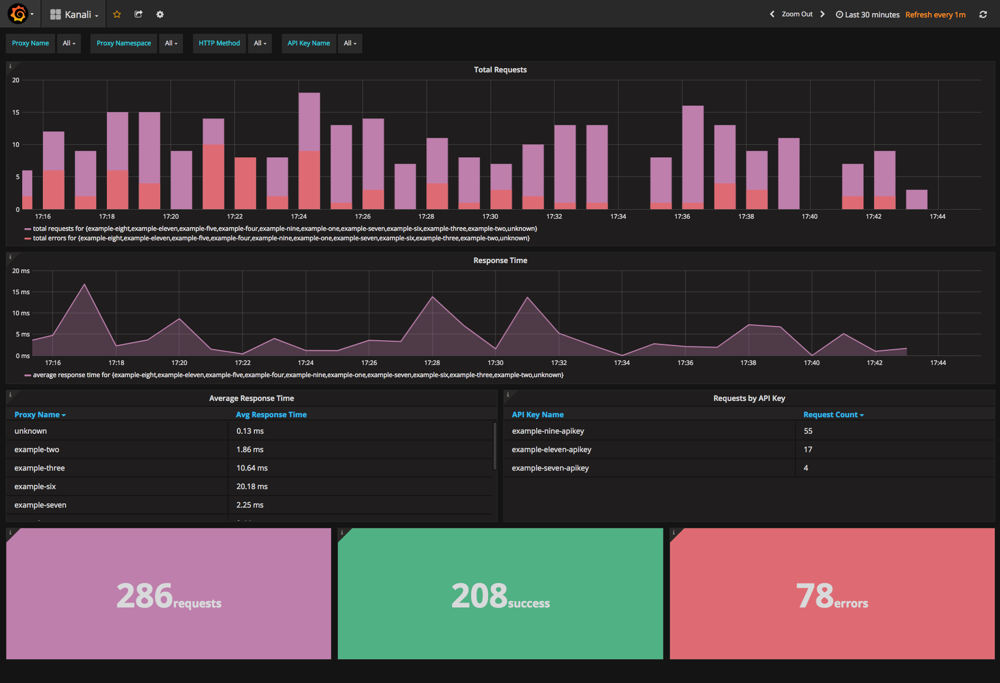

# Kanali

[](https://travis-ci.org/northwesternmutual/kanali) [](https://coveralls.io/github/northwesternmutual/kanali) [](https://github.com/northwesternmutual/kanali/tree/master/docs/docs.md) [](http://opentracing.io) [](http://tutorial.kanali.io) [](https://godoc.org/github.com/northwesternmutual/kanali)
[](https://goreportcard.com/report/github.com/northwesternmutual/kanali)

Kanali is an extremely efficient [Kubernetes](https://kubernetes.io/) ingress controller with robust API management capabilities. Built using native Kubernetes constructs, Kanali gives you all the capabilities you need when exposing services in production without the need for multiple tools to accomplish them. Here are some notable features:

* **Kubernetes Native:** Kanali extends the Kubernetes API by using [Third Party Resources](https://kubernetes.io/docs/tasks/access-kubernetes-api/extend-api-third-party-resource/), allowing Kanali to be configured in the same way as native Kubernetes resources.
* **Performance Centric:** As a middleware component, Kanali is developed with performance as the highest priority! You could instantly improve your application's network performance by using Kanali.
* **Powerful, Decoupled Plugin Framework:** Need to perform complex transformations or integrations with a legacy system? Kanali provides a framework allowing developers to create, integrate, and version control custom plugins without every touching the Kanali codebase. Read more about plugins [here](https://github.com/northwesternmutual/kanali/blob/master/PLUGIN_GUIDE.md).
* **User-Defined Configurations:** Kanali gives you complete control over declaratively configuring how your proxy behaves. Need mutual TLS, dynamic service discovery, mock responses, etc.? No problem! Kanali makes it easy!
* **Robust API Management:** Fine grained API key authorization, quota policies, rate limiting, etc., these are some of the built in API management capabilities that Kanali provides. In addition, it follows native Kubernetes patterns for API key creation and binding making it easy and secure to control access to your proxy.
* **Analytics & Monitoring:** Kanali uses [Grafana](https://grafana.com/) and [InfluxDB](https://www.influxdata.com/) to provide a customizable and visually appealing experience so that you can get real time alerting and visualization around Kanali's metrics. Find out more [here](#analytics-and-monitoring)!
* **Production Ready:** [Northwestern Mutual](https://www.northwesternmutual.com/) uses Kanali in Production to proxy, manage, and secure all Kubernetes hosted services.
* **Easy Installation:** Kanali does not rely on an external database, infrastructure agents or workers, dedicated servers, etc. Kanali is deployed in the same manner as any other service in Kubernetes. Find installation instructions [here](#installation)
* **Open Tracing Integration:** Kanali integrates with [Open Tracing](http://opentracing.io/), hosted by the [Cloud Native Foundation](https://www.cncf.io/), which provides consistent, expressive, vendor-neutral APIs allowing you to trace the entire lifecycle of a request. [Jaeger](http://jaeger.readthedocs.io/en/latest/), a distributed tracing system open sourced by Uber Technologies and recently accepted into the Cloud Native Foundation, is supported out of the box to provide a visual representation for your traces.

# Table of Contents

* [Quick Start](#quick-start)
* [Tutorial](#tutorial)
* [Documentation](#documentation)
* [Versioning](#versioning)
  * [Branches and Tags](#branches-and-tags)
  * [Compatibility](#compatibility)
    * [Kubernetes](#kubernetes)
    * [CustomResourceDefinitions](#customresourcedefinitions)
* [Plugins](#plugins)
* [Security](#security)
* [Analytics, Monitoring, and Tracing](#analytics-monitoring-and-tracing)
* [Installation](#installation)
  * [Helm](#helm)
  * [Manual](#manual)
* [Local Development](#local-development)
* [Usage and Configuration](#usage-and-configuration)
  * [CLI Flags](#cli-flags)
  * [Environment Variables](#environment-variables)
  * [Configuration Files](#configuration-files)

# Quick start

```sh
$ git clone git@github.com:northwesternmutual/kanali.git && cd kanali
$ minikube start --feature-gates CustomResourceValidation=true --kubernetes-version v1.8.0
$ ./scripts/install.sh # wait until all pods are in running state
$ kubectl apply -f ./examples/exampleOne.yaml
$ curl $(minikube service kanali --url --format="https://{{.IP}}:{{.Port}}")/api/v1/example-one
$ open $(minikube service kanali-grafana --url)/dashboard/file/kanali.json
$ open $(minikube service jaeger-all-in-one --url)
```

# Tutorial

A complete guide showcasing all of Kanali's features is provided to ease the learning curve! The guided tutorial can be found [here](http://tutorial.kanali.io).

# Documentation

Looking for documentation for the custom Kubernetes resources that Kanali creates and uses? Find it [here](./docs/docs.md).

# Versioning

_Kanali_ follows [semver](http://semver.org/). A non backwards compatible change will be defined as one that either invalidates the previously required Kubernetes version, breaks any of the CRD resources, or breaks the existing public interfaces (e.g. [`Plugin`](https://github.com/northwesternmutual/kanali/blob/master/plugins/plugin.go#L41-L44) interface).

## Branches and Tags
A new branch and tag will be create for each new major or minor version. At any given time, the master branch will represent `x.(y+1).0-alpha` or `(x+1).0.0-alpha`, where x and y are the current major and minor versions.

Branches will be maintained for at least six months after their first stable tag is cut (e.g. the clock for the release-2.0 branch started ticking when `v2.0.0` was tagged).

Bug fixes, not features, will be ported into older, maintained versions of _kanali_.

## Compatibility

> Always reference the [CHANGELOG](./CHANGELOG.md) for a detailed description of changes between versions.

The following legend will be used for the following matrices:

### Kubernetes

|             | Kubernetes 1.6 | Kubernetes 1.7 | Kubernetes 1.8 |
|-------------|----------------|----------------|----------------|
| kanali 1.0  | ✓              | ✓              | x              |
| kanali 2.0  | x              | x              | ✓              |
| kanali HEAD | x              | x              | ✓              |

`✓` Kanali is fully compatible with this version of Kubernetes  
`†` Kanali is compatible with this version of Kubernetes with proper configuration.   
`x` Kanali is not compatible with this version of Kubernetes

### CustomResourceDefinitions

|             | kanali.io/v1 | kanali.io/v2 |
|-------------|--------------|--------------|
| kanali 1.0  | ✓            | x            |
| kanali 2.0  | x            | ✓            |
| kanali HEAD | x            | ✓            |

`✓` Kanali is fully compatible with this version of the `kanali.io` API group. Every field in the spec potentially modifies behavior.  
`†` Kanali is compatible with this version of the `kanali.io` API group. There are fields that were either added or removed. Their existence will not cause errors and their values, if set, will not modify behavior.   
`x` Kanali is not compatible with this version of the `kanali.io` API group. Fields have been removed from the spec and their existence could cause errors.

# Plugins

While Kanali has its own built in plugins, it boasts a decoupled plugin framework that makes it easy for anyone to write and integrate their own custom and version controlled plugin! The guided tutorial can be found [here](./PLUGIN_GUIDE.md).

# Security

Kanali is lightweight and does not require the deployment of a sidecar container in each application pod. Because of this, there is the potential for internal service to service traffic to occur unauthenticated. Hence, this must be mitigated. Kubernetes provides a resource for this called a [`NetworkPolicy`](https://kubernetes.io/docs/concepts/services-networking/network-policies/). This allows you to require the source of any ingress traffic to a pod be from Kanali. In order to use a `NetworkPolicy`, your Kubernetes cluster must use an overlay network that implements the controller for this resource. Such overlay networks include [Calico](https://docs.projectcalico.org/v2.0/getting-started/kubernetes/) and [WeaveNet](https://www.weave.works/blog/weave-net-kubernetes-integration/).

# Analytics, Monitoring, and Tracing

Kanali leverages [Grafana](https://grafana.com/) and [InfluxDB](https://www.influxdata.com/) for analytics and monitoring. It also uses [Jaeger](http://jaeger.readthedocs.io/en/latest/) for tracing. If you are using Helm to deploy Kanali, these tools are deployed and configured for you.

Jaeger                                           | Grafana             
:-----------------------------------------------:|:-------------------------:
         | 
  |  

# Installation

There are multiple ways to deploy Kanali. For each, a Kubernetes cluster is required. For local testing and development, use [Minikube](https://github.com/kubernetes/minikube) to bootstrap a cluster locally.

Each option below requires cloning this project locally. You can do so with the following command:

```sh
$ git clone https://github.com/northwesternmutual/kanali.git
# $ git clone git@github.com:northwesternmutual/kanali.git
$ cd kanali
```

## Helm

[Helm](https://github.com/kubernetes/helm) is a tool for managing Kubernetes charts. Charts are packages of pre-configured Kubernetes resources. Install Kanali along with Grafana, Influxdb, and Jaeger by using the following commands:

```sh
$ which helm || curl https://raw.githubusercontent.com/kubernetes/helm/master/scripts/get > get_helm.sh | bash
$ helm init
$ ./scripts/helm-permissions.sh
$ kubectl get pods # wait until all pods are up and running
$ helm install ./helm --name kanali
```

## Manual

This installation process only installs Kanali. The deployment of Grafana, Influxdb, and Jaeger as left to the user.

```sh
$ which kubectl || curl -LO https://storage.googleapis.com/kubernetes-release/release/$(curl -s https://storage.googleapis.com/kubernetes-release/release/stable.txt)/bin/darwin/amd64/kubectl && chmod +x kubectl && mv kubectl /usr/bin/kubectl
$ kubectl apply -f kubernetes.yaml
```

# Local development

Below are the steps to follow if you want to build/run/test locally. [Glide](https://glide.sh/) is a dependency.

```sh
$ mkdir -p $GOPATH/src/github.com/northwesternmutual
$ cd $GOPATH/src/github.com/northwesternmutual
$ git clone https://github.com/northwesternmutual/kanali
$ cd kanali
$ make install_ci
$ make kanali
$ ./kanali --help
```

# Usage and Configuration

Kanali can be configured in three different ways. These are highlighted below. Each item takes precedence over the item below it. All possible configuration items are shown in the first example with the later examples demonstrating the conversion factor from the first.

## CLI Flags

```sh
$ kanali [command] [flags]
```

```sh
start
    --analytics.influx_addr string                InfluxDB address. Address should be of the form 'http://host:port' or 'http://[ipv6-host%zone]:port'. (default "http://monitoring-influxdb.kube-system.svc.cluster.local:8086")
    --analytics.influx_db string                  InfluxDB database name (default "k8s")
    --plugins.apiKey.decryption_key_file string   Path to valid PEM-encoded private key that matches the public key used to encrypt API keys.
    --plugins.location string                     Location of custom plugins shared object (.so) files. (default "/")
    --process.log_level string                    Sets the logging level. Choose between 'debug', 'info', 'warn', 'error', 'fatal'. (default "info")
    --proxy.enable_cluster_ip                     Enables to use of cluster ip as opposed to Kubernetes DNS for upstream routing.
    --proxy.enable_mock_responses                 Enables Kanali's mock responses feature. Read the documentation for more information.
    --proxy.header_mask_Value string              Sets the Value to be used when omitting header Values. (default "ommitted")
    --proxy.mask_header_keys stringSlice          Specify which headers to mask
    --proxy.tls_common_name_validation            Should common name validate as part of an SSL handshake. (default true)
    --proxy.upstream_timeout string               Set length of upstream timeout. Defaults to none (default "0h0m10s")
    --server.bind_address string                  Network address that Kanali will listen on for incoming requests. (default "0.0.0.0")
    --server.peer_udp_port int                    Sets the port that all Kanali instances will communicate to each other over. (default 10001)
    --server.port int                             Sets the port that Kanali will listen on for incoming requests.
    --server.proxy_protocol                       Maintain the integrity of the remote client IP address when incoming traffic to Kanali includes the Proxy Protocol header.
    --tls.ca_file string                          Path to x509 certificate authority bundle for mutual TLS.
    --tls.cert_file string                        Path to x509 certificate for HTTPS servers.
    --tls.key_file string                         Path to x509 private key matching --tls-cert-file.
    --tracing.jaeger_agent_url string             Endpoint to the Jaeger agent (default "jaeger-all-in-one-agent.default.svc.cluster.local")
    --tracing.jaeger_server_url string            Endpoint to the Jaeger server (default "jaeger-all-in-one-agent.default.svc.cluster.local")

version
    no flags

help
    no flags
```

## Environment Variables

For each flag above, transform to upper case and append the result to `KANALI_`. As an example, the cli flag `--analytics.influx_addr` would be overwritten with the `KANALI_ANALYTICS.INFLUX_ADDR` environment variable.

## Configuration Files

Kanali accepts configuration files in `JSON`, `YAML`, `TOML`, or `HCL` formats. Each location below takes precedence over the one below it:

* `/etc/kanali/config.ext`
* `$HOME/conifig.ext`
* `./conifig.ext`

Reference [config.toml](./config.toml) for a complete example.
